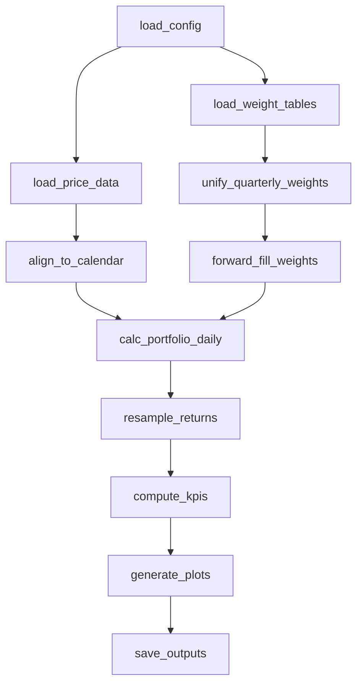
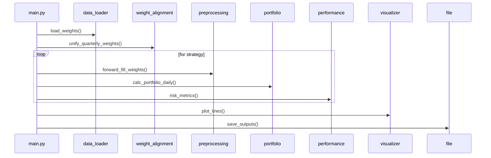

# Fundamental Back-Testing – Software Function Design

## 1. Scope & Objectives
A production-ready Python package that back-tests multiple portfolio strategies (Mean-Variance, Minimum-Variance, Equally-Weighted, DRL) against benchmark indices (S&P 500 – *SPX.csv*, Nasdaq-100 ETF – *QQQ.csv*).  The system ingests pre-computed quarterly/ daily weight tables and daily price data, aligns all series to a unified calendar up to **2025-07-12**, calculates daily / monthly / quarterly performance, risk metrics, and produces publication-quality charts & CSV/Excel outputs.

## 2. Key Performance Indicators (KPIs)
| Category | Symbol | Formula | Expected Output |
|----------|--------|---------|-----------------|
| Absolute Return | CAGR | \((1+R_{tot})^{252/N}-1)\) | Annualised return (\%) |
| Risk | σ | `std(daily_ret)*√252` | Annualised volatility (\%) |
| Risk-Adjusted | Sharpe | \((\text{CAGR}-R_f)/σ)\) | > benchmark |
| Downside | Sortino | \((\text{CAGR}-R_f)/σ_d)\) |  |
| Drawdown | MaxDD | `min(1−V_t/max(V_≤t))` | < −20 % |
| Tail | VaR / CVaR 95/99 | Historical quantile / mean tail | |

KPIs are computed for **each strategy & benchmark** over full back-test and in-sample (≥2018-03-01).

## 3. Inputs
| File | Dir | Type | Description |
|------|-----|------|-------------|
| `final_ratios_oct.csv` | data_processor | CSV | Daily adjusted prices for S&P 500 stocks |
| `mean_weighted.xlsx` | output | Excel | Mean-Variance quarterly weights |
| `minimum_weighted.xlsx` | output | Excel | Minimum-Variance quarterly weights |
| `equally_weighted.xlsx` | output | Excel | Equally weighted quarterly weights |
| `drl_weight.csv` | results | CSV | DRL strategy quarterly weights |
| `SPX.csv` | output | CSV | S&P 500 index daily close |
| `QQQ.csv` | output | CSV | Nasdaq-100 ETF daily close |

## 4. Outputs
* `balance_daily_*.xlsx` – daily price matrix
* `quarter_return_*.xlsx` – quarterly return series
* `test_back/` –
  * `*_cum_drawdown.png`, `*_var.png`, `cum_return_*.png`
  * `risk_metrics_summary.csv`

## 5. Architectural Overview


## 6. Module & Function Specification
### 6.1 `config.py`
```python
DATA_DIR   = Path('data_processor')
OUTPUT_DIR = Path('test_back')
CALENDAR   = pd.date_range('1999-09-01', '2025-07-12')
RISK_FREE  = 0.015
```

### 6.2 `data_loader.py`
| Function | Input | Output | Notes |
|----------|-------|--------|-------|
| `load_price(file:str)` | CSV path | `pd.DataFrame(date,close)` | parse dates |
| `load_weights(file)` | Excel/CSV | `pd.DataFrame(gvkey,trade_date,weights)` | dtype coercion |

### 6.3 `preprocessing.py`
```python
def align_to_calendar(df, cal=CALENDAR, date_col='date', val_col='close') -> pd.Series:
    s = (df.assign(**{date_col: pd.to_datetime(df[date_col])})
           .set_index(date_col)[val_col]
           .reindex(cal, method='ffill'))
    return s
```

### 6.4 `weight_alignment.py`
`unify_quarterly_weights(weight_dict:Dict[str,DataFrame], anchor_key)->Dict[str,DataFrame]`  (见分析文档)
`forward_fill_weights(df_quarterly, cal)` → 日度权重矩阵 (ffill)

### 6.5 `portfolio.py`
```python
def calc_portfolio_daily(weights_daily:DataFrame, returns_daily:DataFrame, init_cap=1e6):
    port_ret = (weights_daily * returns_daily).sum(axis=0)
    port_val = init_cap * (1+port_ret).cumprod()
    return port_ret, port_val
```

### 6.6 `performance.py`
`risk_metrics(returns:Series)->dict`  (公式见 KPIs)
`resample_period(returns, freq)` → 月 / 季度收益

### 6.7 `visualizer.py`
`plot_lines(dict_series, title, save_path)` – generic line plot
`plot_drawdown(series, save_path)`
`plot_var(series, save_path)`

### 6.8 `main.py`
* 读取配置与文件路径
* 对指数、股票价格、权重全部预处理
* 逐策略调用 `calc_portfolio_daily`
* 计算 KPI & 保存 CSV
* 绘制并保存图表

## 7. Function Call Sequence (Quarterly Loop)


## 8. Error Handling & Logging
* Missing dates → forward-fill; leading NaNs back-fill as 0
* Weight rows outside anchor dates → ignored & logged `WARNING`
* KPI division by zero → return `np.nan`

## 9. Extensibility
* Add new strategy: append to `weight_dict` only
* Add new benchmark: read file, `align_to_calendar`, include in plot list
* Additional KPIs: implement in `performance.py`, auto-merge into `risk_metrics_summary.csv`

---
*Version 1.0 – 2025-08-18* 🎯