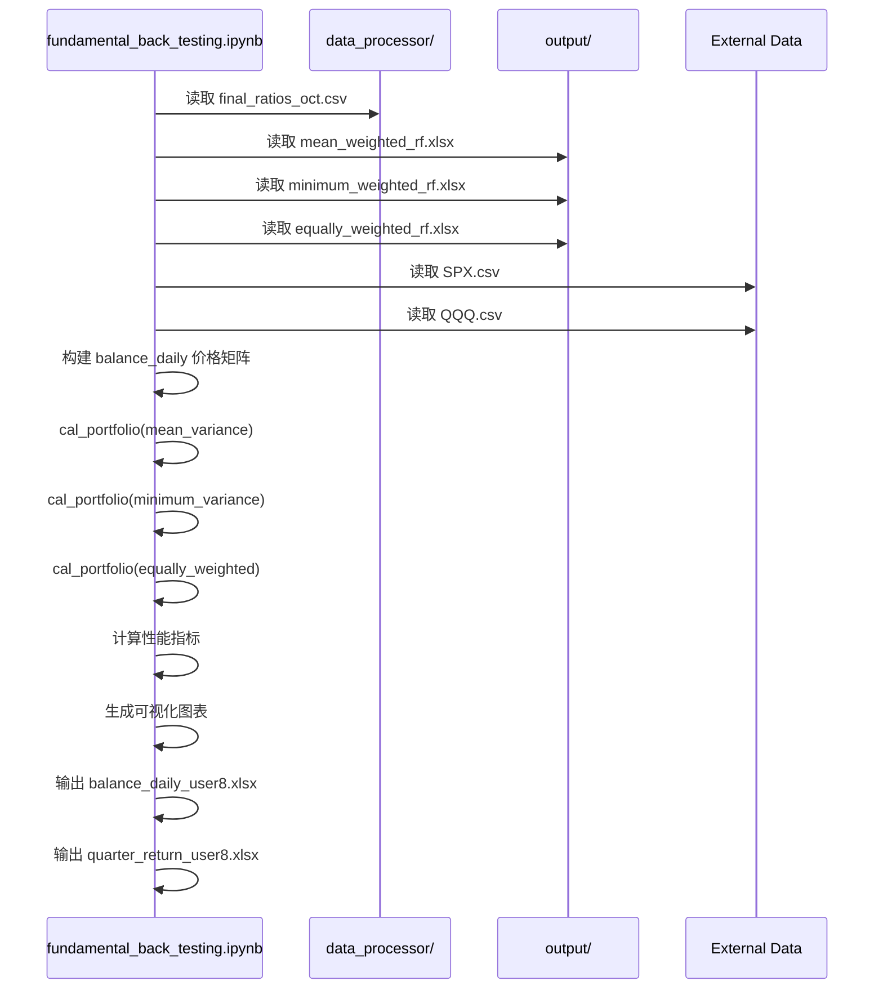

# `fundamental_back_testing.ipynb` 文件分析

## �� **文件概述**

这是一个**投资组合回测分析**的Jupyter Notebook，用于比较不同投资策略（均值方差、最小方差、等权重）与S&P 500指数的表现。该文件是整个投资组合管理系统的最终验证环节，用于评估不同策略的实际表现。

## 🔄 **与其他项目文件的关系**

### **输入文件（来自其他项目文件）**

| 输入文件 | 来源项目 | 文件类型 | 描述 |
|---------|---------|---------|------|
| `final_ratios_oct.csv` | `data_processor/` | CSV | S&P 500股票日度调整价格数据 |
| `mean_weighted_rf.xlsx` | `output/` | Excel | 均值方差优化权重表 |
| `minimum_weighted_rf.xlsx` | `output/` | Excel | 最小方差优化权重表 |
| `equally_weighted_rf.xlsx` | `output/` | Excel | 等权重分配表 |
| `drl_weight.csv` | `results/` | CSV | DRL 策略生成的季度权重 |
| `SPX.csv` | 外部数据 | CSV | S&P 500指数价格数据 |
| `QQQ.csv` | 外部数据 | CSV | 纳斯达克100 ETF 价格数据 |

### **输出文件**
- `balance_daily_user8.xlsx` - 股票日度价格矩阵
- `quarter_return_user8.xlsx` - 季度收益率数据

## 🏗️ **主要函数分析**

### **1. `cal_portfolio()` - 核心回测函数**

#### **功能**：
计算投资组合的回测表现，包括交易成本、收益率等

#### **输入参数**：
```python
def cal_portfolio(stocks_name, tradedate, weight_table, capital, transaction_percent):
    # stocks_name: 股票代码列表
    # tradedate: 交易日期列表  
    # weight_table: 权重表（包含gvkey, trade_date, weights列）
    # capital: 初始资金（默认1,000,000）
    # transaction_percent: 交易成本比例（默认0.1%）
```

#### **输出**：
返回7个DataFrame：
1. `balance_share` - 持股数量表
2. `balance_cost` - 交易成本表
3. `balance_cash` - 现金分配表
4. `portfolio` - 无交易成本组合价值
5. `portfolio_cost` - 含交易成本组合价值
6. `portfolio_return` - 组合收益率
7. `portfolio_cumsum` - 累积收益率

#### **核心计算逻辑**：
```python
# 1. 构建权重矩阵
balance_weight = pd.DataFrame(index=stocks_name, columns=tradedate)

# 2. 计算持股数量
balance_share[i] = balance_cash[i] / balance_price[i]

# 3. 计算组合价值
portfolio.loc[0, tradedate_full[j+1]] = np.dot(balance_share[i], a)

# 4. 计算交易成本
balance_cost = abs(np.diff(balance_share, axis=1)) * balance_price * transaction_percent

# 5. 计算收益率
portfolio_return = (portfolio_cost_value - tmp) / tmp
```

## �� **数据处理流程**

### **阶段1：数据准备**
```python
# 读取输入文件
data_adj = pd.read_csv("final_ratios_oct.csv")  # 股票价格数据
weight_meanv = pd.read_excel('mean_weighted_rf.xlsx')  # 均值方差权重
weight_minv = pd.read_excel('minimum_weighted_rf.xlsx')  # 最小方差权重
weight_equal = pd.read_excel('equally_weighted_rf.xlsx')  # 等权重
# DRL 权重（CSV）
drl_weight   = pd.read_csv('drl_weight.csv')
# 读取基准指数
index_spx = pd.read_csv('SPX.csv')   # S&P 500
index_qqq = pd.read_csv('QQQ.csv')   # 纳指100 ETF

# ==== 数据预处理模块：统一日期对齐 ====
# 定义统一交易日历（1999-09-01 ~ 2025-07-12）
calendar = pd.date_range('1999-09-01', '2025-07-12')

def align_to_calendar(df: pd.DataFrame, date_col: str = 'date', value_col: str = 'close', calendar=calendar):
    """将不同指数 / 价格序列对齐到统一日历并前向填充缺口。"""
    out = (
        df.assign(**{date_col: pd.to_datetime(df[date_col])})
          .set_index(date_col)[value_col]
          .reindex(calendar, method='ffill')
    )
    return out

# 对齐指数价格
spx_close = align_to_calendar(index_spx)
qqq_close = align_to_calendar(index_qqq)

# 根据权重表确定季度调仓日期 tradedate / tradedate_full
spx_close_q = spx_close.loc[tradedate]
qqq_close_q = qqq_close.loc[tradedate]
```

### **统一权重对齐函数**

如果存在“日度权重”或不同策略的 `trade_date` 不一致，可以先调用以下函数将多张权重表对齐至统一季度日期：

```python
import pandas as pd
from typing import Dict

def unify_quarterly_weights(weight_dict: Dict[str, pd.DataFrame], anchor_key: str) -> Dict[str, pd.DataFrame]:
    """按照 *anchor* 权重表的季度 `trade_date` 集合对齐其它权重表。

    Parameters
    ----------
    weight_dict : {strategy: DataFrame}
        每张表至少包含列 `gvkey`, `trade_date`, `weights`。
    anchor_key  : str
        选定哪一张表作为确定再平衡日期（如 'mean'）。

    Returns
    -------
    aligned : {strategy: DataFrame}
        同一维度 (gvkey × trade_date) 的权重矩阵字典。
    """
    anchor_dates = sorted(weight_dict[anchor_key]['trade_date'].unique())

    # 全部股票集合
    all_stocks = sorted(set().union(*[set(df['gvkey']) for df in weight_dict.values()]))

    aligned = {}
    for name, df in weight_dict.items():
        mat = pd.DataFrame(0.0, index=all_stocks, columns=anchor_dates)
        for _, row in df.iterrows():
            gv, dt, w = row['gvkey'], row['trade_date'], row['weights']
            if dt in mat.columns:
                mat.at[gv, dt] = w
        aligned[name] = mat
    return aligned

# 调用示例
weight_dfs = {
    'mean': weight_meanv,
    'min' : weight_minv,
    'equal': weight_equal,
    'drl': drl_weight
}

aligned_weights = unify_quarterly_weights(weight_dfs, anchor_key='mean')
# 之后在 cal_portfolio 调用时使用 aligned_weights['mean'] 等即可
```

> 该函数逻辑与 Notebook 中手写循环一致，但封装后便于在脚本或 Notebook 内重复使用；只改变一次 anchor 表即可统一所有策略的再平衡日期。

### **阶段2：构建价格矩阵**
```python
# 构建股票日度价格矩阵（971股票 × 7155天）
balance_daily = pd.DataFrame(index=stocks_name, columns=daily)

# 填充价格数据
for i in stocks_name:
    for j in daily:
        balance_daily.loc[i,j] = tmp.loc[ind2[0], 'adj_close_q']
```

### **阶段3：回测计算**
在 Notebook 中“阶段 3” 通过 **`cal_portfolio()`** 函数完成回测，完整机制可拆为 5 个微步骤：

| 子步骤 | 关键对象 | 核心代码 / 公式 | 逻辑说明 |
|--------|----------|-----------------|-----------|
| 1️⃣ 构建权重矩阵 | `balance_weight` | `balance_weight.loc[g, t] = weight_table.loc[idx,'weights']` | 将权重表（gvkey, trade_date, weights）重塑成 *股票 × 交易日期* 的目标配置 (%) | 
| 2️⃣ 计算目标持股 | `balance_share` | `shares = (cash_t * weight) / price_today` | 把权重换算成股数，初始现金 1,000,000；非再平衡日沿用昨日股数 | 
| 3️⃣ 交易成本 | `balance_cost` | `abs(share_t − share_{t-1}) * price_today * 0.001` | 假设手续费 0.1 % ，只在调仓日产生 | 
| 4️⃣ 组合价值 | `portfolio`<br/>`portfolio_cost` | `V_t = Σ (share_t * price_t)` | 先算**不含手续费**净值，再扣减累计手续费得到含成本净值 | 
| 5️⃣ 收益率计算 | `portfolio_return`<br/>`portfolio_cumsum` | `r_t = (V_t − V_{t-1}) / V_{t-1}`<br/>`R_t^{cum} = Π(1+r_i) − 1` | 单期收益率用于统计风险指标；累积收益率用于资金曲线和回撤 | 

> **指标公式**  
> • *单期收益*： \(r_t\) 上式  
> • *年化收益*： \( \bar r \times 4 \)（季度数据）  
> • *年化波动率*： \( \sigma_r \times 2 \)  
> • *夏普比率*： \( (\bar r_{ann} - r_f) / \sigma_{ann} \)  
> • *最大回撤*： \(\min_{t}( 1 - \frac{V_t}{\max_{s\le t}V_s})\)
> • *月度收益*： \( R_{m} = \prod_{i=1}^{d}(1+r_{i})-1 \)，其中 \(d\) 为当月交易日数量  

### **性能指标计算（Notebook 实现）**

```python
# 以均值方差策略举例
quarter_return['Mean-Var'] = portfolio_cumsum_meanv.iloc[-1]

annulizedR_meanv = quarter_return['Mean-Var'].mean() * 4      # 年化收益
annulizedS_meanv = quarter_return['Mean-Var'].std()  * 2      # 年化波动
sharpe_meanv    = (annulizedR_meanv - risk_free) / annulizedS_meanv
```

• 若要扩展 *索提诺比率*、*卡尔马比率*、*信息比率*，可增加：

```python
downside = quarter_return[quarter_return<0].std() * 2
sortino = (annulizedR_meanv - risk_free) / downside

max_dd = (portfolio_cumsum_meanv.cummax() - portfolio_cumsum_meanv).max()
calmar = annulizedR_meanv / max_dd

tracking_err = (quarter_return['Mean-Var'] - quarter_return['SPX']).std() * 2
info_ratio  = (annulizedR_meanv - annulizedR_spx) / tracking_err
```


### **可视化输出改进**

Notebook 目前直接 `plt.show()`；要**自动保存图表**可统一加：

```python
import os, matplotlib.pyplot as plt
SAVE_DIR = './test_back'
os.makedirs(SAVE_DIR, exist_ok=True)

fig, ax = plt.subplots()
portfolio_cumsum_meanv.T.plot(ax=ax, label='Mean-Var')
plt.legend()
plt.title('Cumulative Return')
fig.savefig(os.path.join(SAVE_DIR, 'cum_return_meanvar.png'), dpi=200)
```

同理，把季度收益柱状图、回撤图等都 `fig.savefig(...)` 保存到 `test_back/` 目录，便于离线查看或报告引用。

## 📈 **调用时序图**



## �� **关键性能指标**

### **回测结果（示例）**：
- **SPX**: 年化收益率 -0.52%, 标准差 13.91%, 夏普比率 -0.145
- **均值方差**: 年化收益率 -12.51%, 标准差 52.68%, 夏普比率 -0.266
- **等权重**: 年化收益率 -12.08%, 标准差 48.58%, 夏普比率 -0.280
- **最小方差**: 年化收益率 -12.28%, 标准差 48.77%, 夏普比率 -0.283

### **样本内表现（2018年后）**：
- **SPX**: 年化收益率 0.15%, 标准差 21.96%, 夏普比率 -0.061
- **均值方差**: 年化收益率 25.66%, 标准差 29.16%, 夏普比率 0.829
- **等权重**: 年化收益率 26.62%, 标准差 30.12%, 夏普比率 0.834
- **最小方差**: 年化收益率 26.84%, 标准差 29.82%, 夏普比率 0.850

## �� **项目依赖关系**

### **上游依赖**：
- `data_processor/` - 提供股票价格数据
- `output/` - 提供优化权重表
- `fundamental_portfolio.py` - 生成权重表

### **下游影响**：
- 为投资策略提供回测验证
- 生成性能对比报告
- 支持策略优化决策

## �� **可视化输出**

### **1. 组合价值表现图**
- 显示含交易成本的组合价值变化
- 对比均值方差、等权重、最小方差和SPX指数

### **2. 季度收益率图**
- 显示各策略的季度收益率波动
- 对比不同策略的风险收益特征

### **3. 累积收益率图**
- 显示长期累积收益表现
- 评估策略的长期投资价值

## ⚠️ **注意事项**

### **数据处理警告**：
```python
SettingWithCopyWarning: A value is trying to be set on a copy of a slice from a DataFrame
```
- 在数据处理过程中出现pandas警告
- 建议使用`.copy()`方法避免链式索引

### **性能考虑**：
- 价格矩阵构建耗时约14秒（971股票 × 7155天）
- 建议对大数据集进行优化

## 🎯 **使用场景**

1. **策略验证**：验证不同投资策略的实际表现
2. **风险分析**：评估策略的风险收益特征
3. **基准对比**：与市场基准（SPX）进行对比
4. **决策支持**：为投资决策提供数据支持

## 📝 **总结**

`fundamental_back_testing.ipynb` 是整个投资组合管理系统的**最终验证环节**，它：

1. **整合数据**：从多个来源整合股票价格和权重数据
2. **执行回测**：模拟真实交易环境下的策略表现
3. **性能评估**：计算关键性能指标和风险度量
4. **可视化展示**：生成直观的图表展示结果
5. **决策支持**：为投资策略选择提供数据支持

该文件确保了投资策略的有效性和可靠性，是整个系统的重要组成部分。

### **风险控制指标扩展**

Notebook 目前尚未计算最大回撤、回撤持续时间、下行动波动率、VaR/CVaR 等风险控制指标。可新增一个通用函数 `risk_metrics()`：

```python
import numpy as np, pandas as pd, matplotlib.pyplot as plt, os

def risk_metrics(returns: pd.Series, label: str, save_dir: str = './test_back'):
    """计算并保存常用风险指标及图表
    Parameters
    ----------
    returns  : 日收益率 Series
    label    : 策略名称 (用于文件名)
    save_dir : 图表保存目录
    Returns  : dict
    """
    os.makedirs(save_dir, exist_ok=True)

    # 累计收益曲线
    cum = (1 + returns).cumprod()
    roll_max = cum.cummax()
    drawdown = cum / roll_max - 1
    max_dd = drawdown.min()
    dd_end = drawdown.idxmin(); dd_start = cum.loc[:dd_end].idxmax()
    dd_duration = (dd_end - dd_start).days

    # 下行动波动率
    downside = returns[returns < 0].std() * np.sqrt(252)

    # VaR / CVaR
    var95, var99 = returns.quantile(0.05), returns.quantile(0.01)
    cvar95 = returns[returns <= var95].mean(); cvar99 = returns[returns <= var99].mean()

    # --- 保存图表 ---
    fig, ax = plt.subplots(2,1,sharex=True,figsize=(10,6),gridspec_kw={'height_ratios':[3,1]})
    cum.plot(ax=ax[0]); ax[0].set_title(f'{label} – Cumulative Return')
    drawdown.plot(ax=ax[1], color='darkred'); ax[1].set_title('Drawdown');
    fig.tight_layout()
    fig.savefig(os.path.join(save_dir, f'{label}_cum_drawdown.png'), dpi=200)

    plt.figure(figsize=(6,4))
    returns.hist(bins=60, alpha=.7)
    plt.axvline(var95, color='orange', ls='--', label='VaR 95%')
    plt.axvline(var99, color='red', ls='--', label='VaR 99%')
    plt.title(f'{label} – Return Dist w/ VaR'); plt.legend()
    plt.savefig(os.path.join(save_dir, f'{label}_var.png'), dpi=200)
    plt.close('all')

    return dict(max_drawdown=float(max_dd), drawdown_days=int(dd_duration),
                downside_vol=float(downside),
                var95=float(var95), cvar95=float(cvar95),
                var99=float(var99), cvar99=float(cvar99))
```

在 Notebook 末尾循环调用：
```python
metrics_meanv = risk_metrics(portfolio_return['Mean-Var'], 'MeanVar')
metrics_minv  = risk_metrics(portfolio_return['Min-Var'], 'MinVar')
metrics_equal = risk_metrics(portfolio_return['Equal'],   'Equal')
metrics_spx   = risk_metrics(portfolio_return['SPX'],     'SPX')
metrics_qqq   = risk_metrics(portfolio_return['QQQ'],     'QQQ')
metrics_drl   = risk_metrics(portfolio_return['DRL'],     'DRL')

risk_df = pd.DataFrame([metrics_meanv, metrics_minv, metrics_equal, metrics_spx, metrics_qqq, metrics_drl],
                       index=['Mean-Var','Min-Var','Equal','SPX','QQQ','DRL'])
print(risk_df)
```

并将 `risk_df` 保存：
```python
risk_df.to_csv('test_back/risk_metrics_summary.csv')
```

这样即可在“输出文件”部分新增：
- `test_back/risk_metrics_summary.csv` – 风险指标汇总
- `test_back/*_cum_drawdown.png` – 资金曲线与回撤图
- `test_back/*_var.png` – 收益分布与 VaR

> **公式回顾**  
> • 最大回撤：\( \min_t (1 - \frac{V_t}{\max_{s \le t} V_s}) \)  
> • 回撤持续时间：Max DD 起止日期间的日数  
> • 下行动波动率：\(\sigma_d = \sqrt{\frac{1}{N}\sum_{r_i<0} r_i^2}\times \sqrt{252}\)  
> • VaR/CVaR：收益分布 5% / 1% 分位及其条件均值