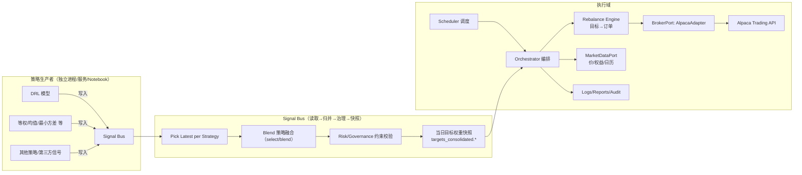

# Signal-Bus 模块化量化交易系统（Alpaca Paper）软件功能说明书

**版本**：v1.0 draft
**作者**：Simon Liao
**日期**：2025-08-22  
**适用环境**：Python 3.10+，Alpaca Paper Trading

---

## 0. 目标与范围

本说明书定义一套“**策略生产与交易执行完全解耦**”的模块化架构：  
- 策略（包括 DRL 与其他模型）仅负责**产出中间文件**（signals）。  
- **Signal Bus** 统一读取/校验/归并/治理信号，并产出**当日目标权重快照**。  
- **执行引擎**读取目标权重 → 与当前持仓对比 → 通过 **Alpaca Broker 适配器**下单。  
- 支持**分钟/日/季度**调度；支持**多策略并存/切换/加权融合**；具备完备的**审计与回溯**能力。

> 本文档为**功能说明书**与**接口契约**，用于评审与确认；实现将在确认后按模块逐步交付。

---

## 1. 架构总览



---

## 2. 数据契约（文件接口）

### 2.1 策略信号文件（输入 Signals）
- **位置**：任意（由 `strategy_manifest.yaml` 指定）  
- **格式**：CSV / XLSX / Parquet（建议最终统一为 Parquet）  
- **最小列集合**：
  - `trade_date`（date, 交易日，NY 交易日或 UTC 日粒度）
  - `asset_id`（string/int，**统一资产主键**；你现有为 `gvkey`）
  - `target_weight`（float，目标权重，long-only 则 ≥0）
- **推荐列**：
  - `strategy_id`（string；Signal Bus 可自动填充）
  - `asof`（datetime；无则用文件 mtime）
  - `confidence`（float，可用于策略融合权重）
  - `predicted_return`（float，可选）
  - 其他自定义元数据

> 兼容你现有文件：  
> - `drl_weight.csv`：`trade_date | gvkey | weights`  
> - `*_weighted.xlsx`：`trade_date | gvkey | weights | predicted_return`  
> Signal Bus 会在加载时统一重命名：`gvkey → asset_id`，`weights → target_weight`。

### 2.2 策略清单（Strategy Manifest）
- **文件**：`signals/strategy_manifest.yaml`
- **用途**：注册策略及其文件位置/格式/列映射  
- **示例**：
```yaml
strategies:
  - id: drl
    path: /mnt/data/drl_weight.csv
    format: csv
    column_mapping: { trade_date: trade_date, gvkey: asset_id, weights: target_weight }

  - id: equal
    path: /mnt/data/equally_weighted.xlsx
    format: xlsx
    column_mapping: { trade_date: trade_date, gvkey: asset_id, weights: target_weight }

  - id: meanvar
    path: /mnt/data/mean_weighted.xlsx
    format: xlsx
    column_mapping: { trade_date: trade_date, gvkey: asset_id, weights: target_weight }

  - id: minvar
    path: /mnt/data/minimum_weighted.xlsx
    format: xlsx
    column_mapping: { trade_date: trade_date, gvkey: asset_id, weights: target_weight }
```

### 2.3 目标权重快照（Signal Bus 输出）
- **文件**：`outputs/targets_consolidated.parquet`（或 csv）  
- **列**：`trade_date, asset_id, target_weight, asof, strategy_set_id?, blend_mode?, run_id?`  
- **语义**：当日（或当期）用于执行的**最终目标权重**（已通过治理与归一化）。

### 2.4 资产映射表（可选）
- **文件**：`refdata/instrument_map.csv`  
- **列**：`asset_id, symbol, name, exchange, currency, ...`  
- **用途**：在执行前将 `asset_id` 映射为券商可识别的 `symbol`。

### 2.5 执行日志与回执
- `logs/exec_YYYYMMDD.csv`：保存本次执行的目标、订单、回执、错误码等，便于追溯。

---

## 3. 模块与接口定义

### 3.1 Strategy Producers（策略生产者，独立于本系统）
**职责**：只产出中间文件，不调用交易接口。  
**输出**：符合 2.1 的文件。  
**增量扩展**：新增策略仅需在 Manifest 中登记。

**测试设计**：
- **TC-SP-01**：输出包含最小列集合，类型正确（date/float）。  
- **TC-SP-02**：同日多次产出，`asof` 递增，Signal Bus 能选最新。  
- **TC-SP-03**：极端权重（全 0、单一资产 1.0）被下游正确处理（治理/归一化）。

---

### 3.2 Signal Bus（读取→归并→治理→快照）
**关键类/函数**：
- `load_manifest(path) -> List[StrategySpec]`
- `load_all_strategies(manifest) -> DataFrame`：按列映射读取多个文件，标准化列名与类型。
- `pick_latest_per_strategy(df) -> DataFrame`：同 `(strategy_id, trade_date, asset_id)` 取 `asof` 最新。
- `blend_strategies(df, trade_date, blend, mode) -> DataFrame`：
  - `mode='select'`：单选（优先级或权重最大者）
  - `mode='blend'`：按 `blend={strategy_id: weight}` 进行线性融合
- `enforce_limits(df, max_weight, blacklist) -> DataFrame`：治理（上限/黑名单/归一化）。
- `save_targets(df, out_path)`：写当日快照。

**流程（单次运行）**：
1. 读 Manifest → 多文件加载与标准化  
2. 选最新版本（asof）  
3. 依配置（select/blend）生成当日目标  
4. 治理（上限/黑名单/归一化）  
5. 写出目标快照（供执行引擎读取）

**测试设计**：
- **TC-SB-01（加载与映射）**：4 个示例文件能正确合并，列映射生效。  
- **TC-SB-02（最新性）**：同一键下多版本，仅保留 `asof` 最大记录。  
- **TC-SB-03（单选）**：`mode=select` 时，按优先策略产出与输入一致。  
- **TC-SB-04（融合）**：`mode=blend` 按给定权重线性组合，结果长短合规，权重和=1。  
- **TC-SB-05（治理）**：`max_weight`、`blacklist` 生效并重归一化。  
- **TC-SB-06（缺列/空文件）**：报错/降级策略合理（可配置：跳过或失败）。

---

### 3.3 Risk Manager（风控/治理层）
**职责**：对目标权重进行约束与修剪，保证可执行性与合规。  
**策略**：
- 单资产最大/最小权重、行业/主题黑名单
- 净敞口/杠杆（扩展）
- 波动/动荡（turbulence/波动阈值）暂停买入（扩展）
- 换手上限（与 Rebalance 配合）

**接口**：`filter_targets(targets, state) -> targets'`

**测试设计**：
- **TC-RISK-01**：上限裁剪 + 归一化。  
- **TC-RISK-02**：黑名单资产权重归零并重分配。  
- **TC-RISK-03**：在高波动日触发“只减不加”（扩展）。

---

### 3.4 Rebalance Engine（目标→订单转换，纯逻辑）
**职责**：根据**目标权重/价格/账户权益**与**当前持仓**，产出**抽象订单**列表。  
**输入**：`targets{asset_id→weight}, prices{symbol→px}, equity, current_qty{symbol→qty}`  
**输出**：`orders = [{symbol, side(BUY/SELL), qty|notional, type}]`  
**配置**：
- `allow_fractional`（碎股）
- `min_notional`（最小成交额）
- `max_turnover`（最大换手率，粗略控制）

**测试设计**：
- **TC-REB-01**：基础差额 → 市价单（qty）。  
- **TC-REB-02**：禁用碎股 → 改用 notional。  
- **TC-REB-03**：过小订单被过滤（`min_notional`）。  
- **TC-REB-04**：`max_turnover` 限制生效（按比例缩放）。  
- **TC-REB-05**：价格缺失/0/NaN → 跳过并记录。

---

### 3.5 Execution Policy（执行策略）
**职责**：将**抽象订单**映射成**券商请求**（市价/限价/Bracket/Stop/Trailing、TIF…）。  
**接口**：`build_request(symbol, side, qty|notional, last_price?) -> AlpacaRequest`  
**约束**：
- Bracket 需满足：买入时 `TP ≥ base + 0.01`，`SL ≤ base - 0.01`（卖出反向）。
- 低价股边界处理（四舍五入到 0.01 美元）。

**测试设计**：
- **TC-EP-01**：`mode=market` 生成 `MarketOrderRequest`。  
- **TC-EP-02**：`mode=bracket` 严格满足 TP/SL 约束，边界价通过。  
- **TC-EP-03**：notional 与 qty 互斥路径均可用。

---

### 3.6 Broker Adapter（Alpaca 实现）
**职责**：对接 Alpaca Trading API，仅负责**下单与查询**，不参与策略逻辑。  
**接口**：
- `get_positions() -> {symbol: qty}`  
- `submit(orders) -> receipts`  
- `get_orders(after, until)`

**测试设计**（可用 Mock）：
- **TC-BRK-01**：提交市价/Bracket/Stop/Trailing 能正确构造请求。  
- **TC-BRK-02**：Paper 环境碎股/金额下单通过。  
- **TC-BRK-03**：Alpaca 422/429 等错误映射到可读日志并不中断批次。  
- **TC-BRK-04**：幂等/重复提交保护（可基于 client_order_id 扩展）。

---

### 3.7 MarketDataPort（行情/权益）
**职责**：提供**最新价格**与**账户权益**（或策略自定义资金规模）、交易日历（可选）。  
**接口**：
- `get_last_prices(symbols) -> {symbol: price}`  
- `get_equity() -> float`  
- `get_trading_days(start, end) -> List[date]`（可选）

**测试设计**：
- **TC-MD-01**：价格/权益返回类型正确；缺失符号报错或返回 NaN。  
- **TC-MD-02**：交易日历与 NYSE 对齐（如启用）。

---

### 3.8 Scheduler & Orchestrator（调度与编排）
**Scheduler**：决定**何时**触发一次完整执行：  
- `EveryBar(n sec)`、`EndOfDay(NY)`、`QuarterEnd(NY)`

**Orchestrator**：一次执行包含：  
1. 读取当日 `targets_consolidated`  
2. 读取 `positions / prices / equity`  
3. Risk 过滤（可选）  
4. Rebalance → orders  
5. Broker 提交 → receipts  
6. 记录日志/回执/异常

**测试设计**：
- **TC-ORC-01**：在无目标文件时安全退出并报警。  
- **TC-ORC-02**：完整路径产出订单并收到回执。  
- **TC-ORC-03**：异常与部分失败下的降级与重试策略。

---

### 3.9 Observability & Audit（可观测性与审计）
- **日志**：结构化日志（json/csv），记录 `run_id / strategy_set / blend_mode / targets hash / orders / receipts / errors`。  
- **回放**：根据某日 `targets_consolidated` + 价格重算持仓路径。  
- **告警**：目标为空、映射失败、价格缺失、下单失败比例超阈。

**测试设计**：
- **TC-OBS-01**：日志字段齐全，可按 `run_id` 搜索。  
- **TC-OBS-02**：日志与 Alpaca 控制台记录可对账。

---

### 3.10 配置与密钥
- 配置文件：`config.yaml`（文件路径、blend、risk 参数、执行策略、调度）  
- 密钥：优先用环境变量 `ALPACA_API_KEY_ID/ALPACA_API_SECRET_KEY`；不写入日志。

**测试设计**：
- **TC-CFG-01**：缺失某项配置时有默认值与友好提示。  
- **TC-CFG-02**：不同环境（dev/stage/prod）切换。

---

## 4. 典型执行流程

### 4.1 日频（End-of-Day）
1. T-0：策略持续产出/追加 signal 文件。  
2. T：收盘后 → 运行 Signal Bus：`select/blend + 治理 → targets_consolidated`。  
3. T+：执行引擎读取目标 → 计算差额 → 下单（可在收盘后或次日开盘时段）。

### 4.2 季度末频率
- 调度器只在季度末交易日的收盘后触发上述流程。

### 4.3 分钟级（近实时）
- 调度器每 N 秒触发 Orchestrator；Signal Bus 可按**文件时间戳**选择“同日最新”目标。

---

## 5. 迁移与兼容

- 兼容现有 `drl_weight.csv`、等权/均值/最小方差 Excel 文件。  
- `AlpacaPaperTrading` 拆分为：Strategy（外部）/ Signal Bus / Rebalance / BrokerAdapter / Orchestrator。  
- 分阶段上线：先用 `mode=select`（仅 DRL），再引入 `blend`。

---

## 6. 非功能性要求

- **可靠性**：Signal Bus 与执行引擎失败不互相影响（解耦）。  
- **可扩展**：新增策略仅需注册 Manifest；新增券商仅需新 Adapter。  
- **可观测**：每次执行有完整审计链。  
- **性能**：单日 10k+ 标的、百万级行读取与合并（建议 Parquet + 分区）。  
- **安全**：密钥仅环境变量传递，避免写盘。

---

## 7. 测试计划总览

| 层级 | 用例编号 | 目标 |
|---|---|---|
| 单元 | TC-SB-01..06 | Signal Bus 加载/融合/治理 |
| 单元 | TC-REB-01..05 | Rebalance 目标→订单 |
| 单元 | TC-EP-01..03 | Execution Policy（市价/Bracket） |
| 单元 | TC-BRK-01..04 | Broker 适配器行为与错误映射 |
| 单元 | TC-RISK-01..03 | Risk 约束 |
| 单元 | TC-MD-01..02 | MarketDataPort |
| 集成 | TC-ORC-01..03 | Orchestrator 端到端（含日志） |
| 回归 | REG-01 | 四个策略文件示例在 2018-03-01 的一致性输出 |
| 压测 | PERF-01 | 10k+ 资产、百万行信号吞吐 |
| 故障 | CHAOS-01 | 文件缺失/损坏、部分下单失败的降级策略 |

---

## 8. 实施里程碑

1. **M1：Signal Bus**（加载→单选/融合→治理→快照；含 Manifest）  
2. **M2：Rebalance Engine**（含最大换手/最小成交额）  
3. **M3：Alpaca Broker Adapter + Execution Policy**（市价/Bracket）  
4. **M4：Orchestrator + Scheduler**（日频 & 季度末）  
5. **M5：Observability**（日志/回执/告警）  
6. **M6：Risk 扩展**（黑名单、净敞口、波动门控）  
7. **M7：E2E 验收**（以 4 个示例策略重放 2018-03-01）

---


